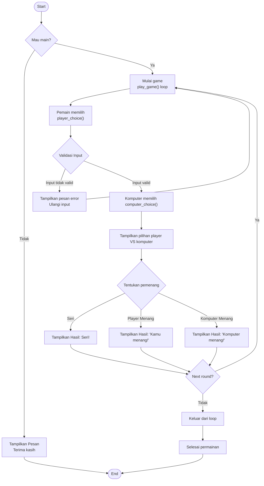

# Group-2-Pengenalan-Pemrograman
ROCK, PAPER, SCISSORS (RPS) GAME

For this assesment, we've created a Rock, Paper, Scissors (RPS) Game. Choose your choice!
# Pendahuluan
  Program yang kami buat adalah game RPS atau Rock, Paper, Scissors (Batu, Gunting, Kertas). Game ini telah dikenal banyak orang sebagai permainan yang dapat dimainkan secara 
bersama-sama dan menggunakan cara tradisional yaitu dengan mengeluarkan gerakan tangan membentuk batu, gunting, atau kertas. Namun, pada permainan yang kami buat ini, pemain tidak perlu berhadapan dengan seseorang agar dapat memainkannya. Di sini pemain akan berhadapan dengan komputer yang akan menjadi lawan dari pemain. So, beat the computer and be the winner!
# Fitur-fitur utama
 1. **Arsitektur Kode Modular**
 
  Kami membuat program ini menggunakan teknik modular. Yaitu teknik yang tidak menumpuk semua kode pada satu tempat,   melainkan membaginya ke dalam beberapa file yang berbeda agar lebih terorganisir, dengan pembagian sebagai berikut:

a). **_main.py_**: Berfungsi sebagai pusat kendali yang menyapa pemain dan menjalankan alur permainan dari awal sampai akhir.

b). **_player_choice.py_**: Bertanggung jawab untuk mengambil input atau pilihan dari pemain.

c). **_computer_choice.py_**: Bertanggung jawab menciptakan lawan tanding dengan menghasilkan pilihan acak dari komputer.

d). **_winner.py_**: Bertindak sebagai "wasit" yang memproses pilihan pemain dan komputer untuk menentukan siapa pemenangnya.

2. **Validasi Input yang Cerdas (Anti-Error)**

Kami menambahkan fitur ini untuk memastikan program tidak akan berhenti atau rusak jika pemain salah mengetik. fitur yang dimaksud yaitu _**Case Insensitive dan Loop Pengamanan**_.

a). _**Case Insensitive** _(.lower) berfungsi agar pemain bisa mengetik dengan huruf besar maupun kecil (misalnya: "BATU", "Batu", atau "batu"), dan program akan tetap mengenalinya, dan

b). _**Loop Pengamanan**_ (while) yang berfungsi apabila pemain mengetik kata yang salah dimana kata yang dimaksud salah yaitu kata selain batu gunting dan kertas. program akan menampilkan pesan seperti "input tidak valid" dan akan terus bertanya hingga pemain memasukkan pilihan kata yang benar.

3. **Musuh dengan pilihan Acak**

Program ini memberikan tantangan yang nyata karena pilihan komputer tidak bisa ditebak:

Menggunakan library random untuk memilih antara batu, gunting, atau kertas secara otomatis dengan peluang yang sama adilnya.

4. **Sistem Penentu Kemenangan yang Akurat**
   
Program dibuat seperti memiliki pikiran secara logika untuk menilai pertandingan berdasarkan aturan standar yang berlaku, seperti kapan pemain dinyatakan menang, kalah dan bahkan saat seri terjadi. Fitur ini terdapat pada file winner.py.

5. **Antarmuka Visual yang Rapi (Terminal UI)**

Meskipun hanya berupa teks di terminal, kami berusaha membuat agar program ini dapat memberi tampilan yang nyaman untuk dilihat. Dengan menambahkan bingkai  karakter seperti = dan * agar terlihat lebih menarik serta teks rata tengah (Center Aligned) sehingga tampilan terlihat profesional dan simetris.
# Panduan Instalasi

Untuk bisa menjalankan program ini, ikuti langkah-langkah yang diperlukan sebagai berikut:

1. **Persiapan Perangkat Lunak**

hal pertama yang wajib diperhatikan adalah memastikan bahwa Pytho 3 sudah terpasang pada komputer dengan benar. karena program ini dibuat dan hanya bisa dijalankan menggunakan bahasa Python. Sehingga jika Python tidak terinstal, kode ini tidak akan bisa dijalankan. Jadi jika belum memilikinya, kamu bisa mengunduhnya secara gratis di python.org.

2. **Menyiapkan File Program**
   
Program ini terbagi menjadi beberapa bagian (modular), sehingga semua file harus di download terlebih dahulu kemudian disimpan dalam satu folder yang sama agar dapat saling terikat. langkah sederhananya sebagai berikut:

a). Download ke 4 file py yang terdapat pada repositories yakni: main.py; player_choice.py; computer_choice.py dan winner.py.

b). Buat sebuah folder baru pada komputer kemudian beri nama, misalnya diberi nama GameBatuGuntingKertas.

c). Kemudian simpan ke-4 file yang sudah didowload kedalam file baru yang baru dibuat.

3. **Instalasi Library Tambahan tidak diperlukan**
   
salah satu keunggulan dari program ini adalah kesederhanaannya, Sehingga tidak perlu menginstal library tambahan melalui terminal seperti pip install dan sebagainya, karena program ini hanya menggunakan library bawaan Python yaitu random.

# Panduan Menjalankan
Setelah semua file program berhasil disiapkan dalam satu folder, langkah selanjutnya adalah menjalankan game Rock, Paper, Scissors. Ikuti langkah-langkah berikut:

1. Membuka Terminal / Command Prompt

Buka terminal (Linux / macOS) atau Command Prompt (Windows), kemudian arahkan ke folder tempat file program disimpan.
Contoh jika folder bernama GameBatuGuntingKertas: cd GameBatuGuntingKertas

2. Menjalankan Program

Jalankan file utama program, yaitu main.py, dengan perintah berikut:
python main.py

atau jika pada sistem menggunakan Python 3 secara eksplisit:
python3 main.py

3. Memainkan Game

a) Program akan menampilkan tampilan awal dan menyapa pemain.

b) Pemain diminta untuk memasukkan pilihan batu, gunting, atau kertas.

c) Komputer akan memilih secara otomatis.

d) Hasil permainan (menang, kalah, atau seri) akan ditampilkan di layar.

4. Melanjutkan atau Mengakhiri Permainan

Setelah satu ronde selesai, pemain dapat memilih untuk melanjutkan permainan atau menghentikannya sesuai dengan instruksi yang ditampilkan pada layar.

# Dokumentasi Teknis

# Daftar Kontributor
| Nama                     | NIM          | Roles              | Link Akun Github                |
|--------------------------|--------------|--------------------|---------------------------------|
| Virginia Aurel Umboh     | 250211060015 | Project Maintainer | https://github.com/virginicquez |
| Timothy Wayne Moningkey  | 250211060013 | Collaborator       | https://github.com/TrZee10      |
| Kelvi Kassa Pairunan     | 250211060022 | Collaborator       | https://github.com/Kelvi-67     |
